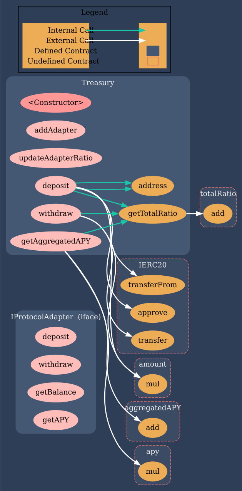

# Treasury Smart Contract
 </br>

<p>
    This project is an implementation of a smart contract that can receive funds in the form of stablecoins and distribute them among different liquidity pools and DeFi protocols. The smart contract allows the owner to set the distribution ratio dynamically and withdraw funds partially or fully from the protocols.
    
</p>

 ### Demo:

   
 https://goerli.etherscan.io/address/0x8f8061234e19746950a5C95c643Af83d68fa0806#writeContract

# Overview

The Treasury Smart Contract is a Solidity contract that can interact with other protocols such as Uniswap, AAVE, and others to distribute funds among different liquidity pools and DeFi protocols. The contract receives funds in the form of a stablecoin (e.g. USDC), and the funds are then swapped for other stablecoins (e.g. USDT, DAI) in case of a liquidity pool. The distribution ratio of these funds can be set by the contract owner and can be changed dynamically after deployment to the test/mainnet chains.

<br/>

### The contract has the following functionalities:

* Receiving funds (stablecoins)
* Distributing funds among different liquidity pools and DeFi protocols
* Swapping funds for other stablecoins (in case of a liquidity pool)
* Withdrawing funds partially or fully from the protocols
* Calculating the aggregated percentage yield of all the protocols

<br/>

# Architecture

<br/>

### The Treasury Smart Contract consists of the following components:

* Treasury contract: This is the main contract that handles the receiving, distributing, and withdrawing of funds. It also calculates the aggregated percentage yield of all the protocols. It contains a list of IProtocolAdapter and a list of distribution ratios for each adapter.
* IProtocolAdapter: This is an interface that defines the functions that each protocol adapter should implement. It contains the functions deposit, withdraw, getBalance, and getAPY.
* ProtocolAdapter: This is an example implementation of a protocol adapter that interacts with a single protocol (e.g. Uniswap or AAVE). You can create multiple protocol adapters for different protocols.

<br/>




<br/>

# Usage

### To use the Treasury Smart Contract, follow these steps:

* Deploy the Treasury.sol contract to a test/mainnet network.
* Add protocol adapters and distribution ratios using the addAdapter function. The contract owner can set the distribution ratio dynamically using the updateAdapterRatio function.
* Users can deposit stablecoins to the contract using the deposit function. The stablecoins will be distributed among the protocols according to the distribution ratio.
* The contract owner can withdraw funds partially or fully from the protocols using the withdraw function.
* Users can check the aggregated percentage yield of all the protocols using the getAggregatedAPY function.


<br/>

# Installation
### To install the dependencies, run the following command:

Run command: 
 ``` 
 git clone https://github.com/blcdevs/treasury-smart-contract.git   
```


 ```
 $ npm install
 ```    

  ```
 $ npx hardhat test

 ```    

 # Deployment

  ```
 $ npx hardhat compile

 ```  

  ```

  ```
   $ npx hardhat run scripts/deploy.js --network goerli
  ```
 $ npx hardhat verify --network goerli smart contract address stablecoin address

 ```  

 ### To deploy the contract to a mainnet network, run the following command:


```
npx hardhat run --network mainnet scripts/deploy.js
```

# Conclusion

The Treasury Smart Contract is a powerful tool that allows you to distribute funds among different liquidity pools and DeFi protocols. It is flexible, customizable, and easy to use. By using this contract, you can optimize your yield farming strategy and maximize your returns.


